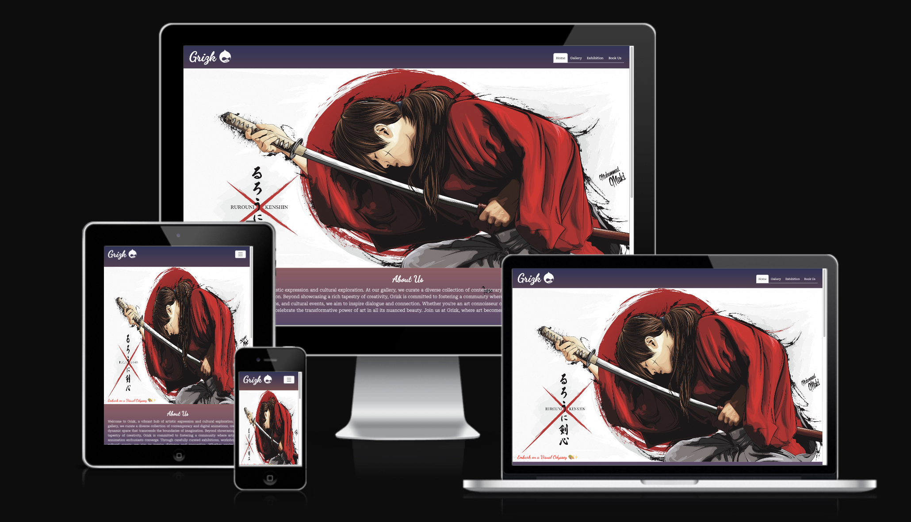
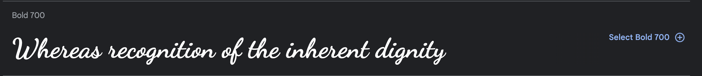
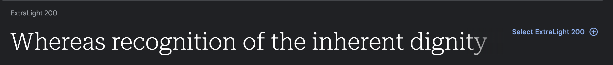
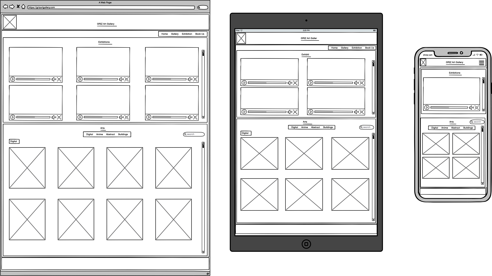
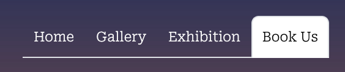
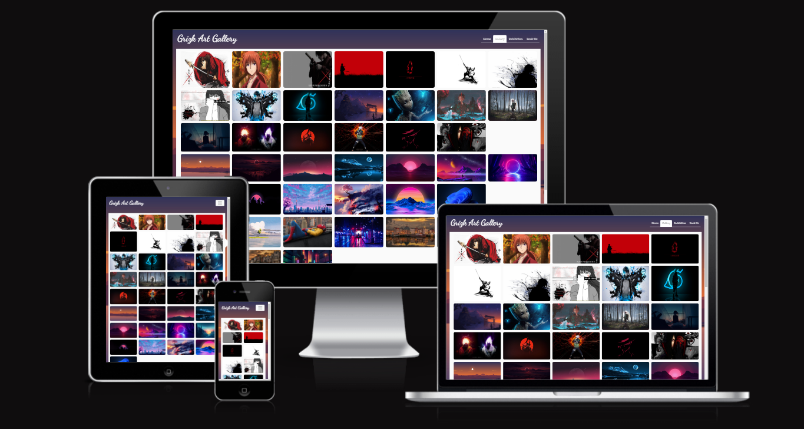
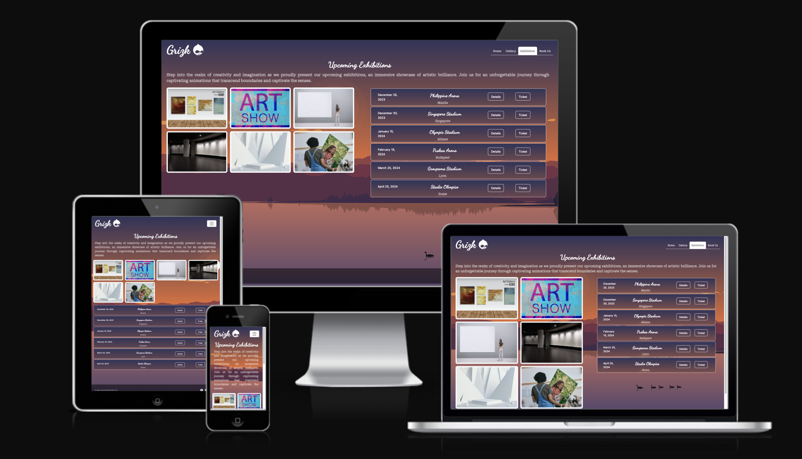
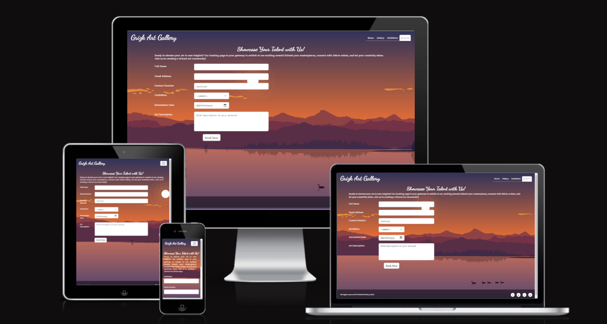
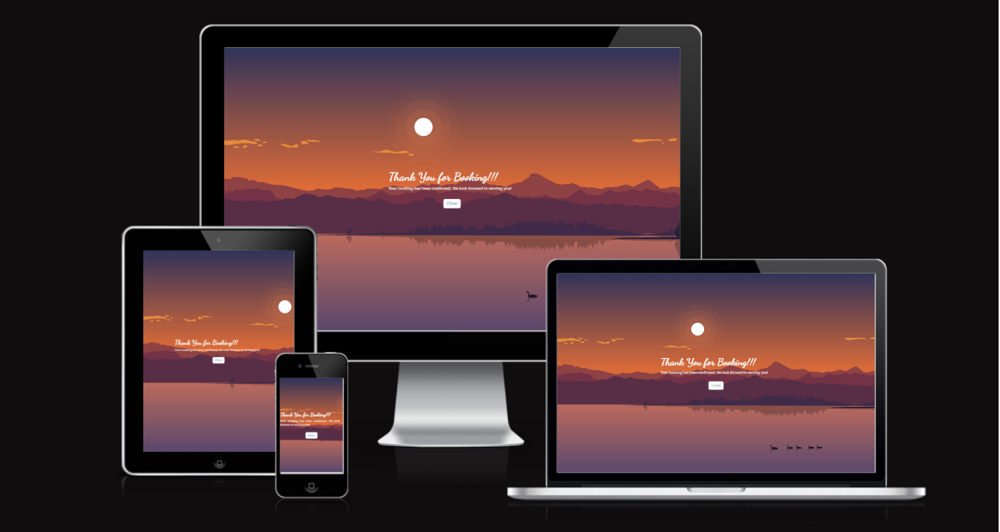
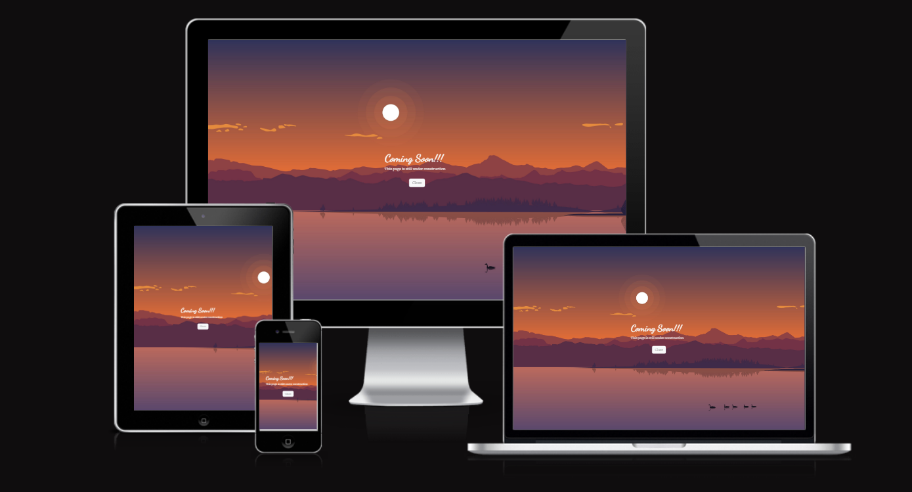

# Grizk Art Gallery

Visit the deployed site: [Grizk Art Gallery](https://gokwori.github.io/Grizk-Gallery/)

Embark on a journey into artistic expression at Grizk, a vibrant hub of contemporary and digital artworks. Dive into a dynamic space transcending imagination, fostering a community of artists and enthusiasts. Through curated exhibitions and cultural events, we inspire dialogue and connection. Join us at Grizk, where art transforms into a shared experience, leaving an indelible mark on your memories' canvas.

## CONTENTS

* [User Experience](#user-experience-ux)
  * [Project Goals](#project-goals)
  * [Art Lovers' Goals](#art-lovers-goals)
  * [Artists' Goals](#artists-goals)
  * [Business Goals](#business-goals)
  * [User Stories](#user-stories)
  

* [Design](#design)
  * [Colour Scheme](#colour-scheme)
  * [Typography](#typography)
  * [Imagery](#imagery)
  * [Wireframes](#wireframes)
  * [Features](#features)
    * [The Home Page](#the-home-page)
    * [The Gallery Page](#the-gallery-page)
    * [The Exhibition Page](#the-exhibition-page)
    * [The Booking Page](#the-booking-page)
    * [The Thank you Page](#the-thank-you-page)
    * [The Coming soon Page](#the-coming-soon-page)
    * [Future Implementations](#future-implementations)
  * [Accessibility](#accessibility)

* [Technologies Used](#technologies-used)
  * [Languages Used](#languages-used)
  * [Frameworks, Libraries & Programs Used](#frameworks-libraries--programs-used)

* [Deployment & Local Development](#deployment--local-development)
  * [Deployment](#deployment)
  * [Local Development](#local-development)
    * [How to Fork](#how-to-fork)
    * [How to Clone](#how-to-clone)

* [Testing](#testing)
  * [Solved Bugs](#solved-bugs)
  * [Known Bugs](#known-bugs)
  
* [Credits](#credits)
  * [Code Used](#code-used)
  * [Content](#content)
  * [Media](#media)
  * [Acknowledgments](#acknowledgments)

- - -

## User Experience (UX)

### Project Goals

The Grizk Official Website aims to create an engaging and informative platform for art enthusiasts and artists. Key objectives include presenting the gallery's mission, featuring recent releases and upcoming exhibitions, and simplifying the booking process for artists. The website serves as a strategic tool to boost art and ticket sales while attracting more exhibition bookings, aligning with broader business goals.

### Art Lovers Goals

* Learn about the gallery's objectives and vision for the art community.
* Explore and preview the most recent releases and additions to the gallery's collection.
* Receive updates on upcoming exhibitions, cultural events, and workshops.
* Browse the extensive art catalog showcasing diverse and contemporary artworks.
* Easily find and purchase artworks to enhance your personal collection.

### Artists Goals

* Simplify and expedite the exhibition booking process for artists.
* Provide clear and concise details about the gallery's availability for exhibitions.
* Foster collaboration between the gallery and artists to ensure seamless and successful exhibitions.

### Business Goals

* Create an aesthetically pleasing and user-friendly website to enhance the overall user experience.
* Increase the gallery's online presence and engagement with the audience.
* Drive art sales through effective showcasing and presentation of artworks on the website.
* Streamline the exhibition booking process for artists to encourage more participation.

### User Stories

#### Art Lovers:
* I want to easily access information about the gallery's objectives and mission.
* I want a user-friendly platform to discover and preview the latest artwork releases.
* I want to stay informed about upcoming exhibitions and events hosted by the gallery.
* I want the ability to explore the full art catalog and conveniently purchase paintings.

#### Artists:
* I want a simplified and expedited process for booking exhibitions at the gallery.
* I want clear information about the gallery's availability for exhibitions and submission guidelines.

#### General Users:
* I want a visually appealing and intuitive interface that is easy to navigate.
* I want the website to load quickly and efficiently to access information without delays.
* I want the website to be responsive and provide a seamless experience on various devices.

- - -

## Design Choices

### Colour Scheme

In the design of the art gallery website, I've intentionally selected a colour scheme dominated by `#fafafa` and `#4b4453` to complement the background image. The soft `#fafafa` serves as a subtle and clean backdrop, preventing the background image from overwhelming users. Meanwhile, the deep `#4b4453` adds sophistication and contrast, contributing to an aesthetically pleasing and balanced visual experience. This careful integration of colors ensures that the background image enhances the overall design without overpowering or distracting users, creating a harmonious and engaging atmosphere on the website.

### Typography

Google Fonts was used to import the chosen fonts for use in the site.

* For the Page Title and Headings I have used the google font [Dancing Script](https://fonts.google.com/?preview.text=Grizk%20Art%20Gallery&preview.text_type=custom&query=dancing+script). Dancing Script is a lively and script-style font selected to evoke a sense of movement and artistic flair. Its graceful and flowing appearance adds a touch of elegance, reminiscent of handwritten scripts, creating a captivating visual experience for the page titles and headings.

* For the body of the page I have used the google font [Roboto Serif](https://fonts.google.com/?preview.text=Grizk%20Art%20Gallery&preview.text_type=custom&query=roboto+serif). Roboto Serif, with its varied font weights ranging from 200 to 800, provides a modern and sophisticated look. This font choice brings a balanced and clean aesthetic to your website's text, ensuring readability while maintaining a touch of refinement.

### Imagery

As Grizk Art Gallery celebrates diverse artistic expressions, the website showcases a dynamic blend of digital pictures, anime, 3D arts, and cityscapes sourced from [Wallpaper flare](https://www.wallpaperflare.com/). Each image carefully curated to immerse visitors in the rich tapestry of creativity, inviting them to explore the vibrant world of art within the virtual gallery.

### Wireframes

Wireframes were created for mobile, tablet and desktop using balsamiq.

### Features

The website is comprised of a home page, a gallery page, an exhibition page, a booking page, a thank-you page & a coming-soon page.

All Pages on the website are responsive and have:

* A favicon in the browser tab.

  

* The title of the site at the top of every page. This title serves as a clickable link that seamlessly navigates users back to the home page. The title design is elegantly presented to provide a consistent and intuitive user experience across the site.

  

* The website incorporates a streamlined and visually appealing navigation menu, facilitating easy access to key sections. Users can seamlessly explore different pages, including Home, Gallery, Exhibition, and Booking, enhancing overall navigation efficiency. The navigation menu is collapsible for a seamless experience on smaller screens.

  

* In the footer section, social media links are prominently displayed, providing users with direct access to the gallery's presence on popular platforms. The inclusion of links to Facebook, Twitter, Instagram, and YouTube fosters connectivity and engagement, allowing art enthusiasts to stay updated on the latest news and events.

  

#### The Home Page

The home page is thoughtfully designed to provide an engaging and immersive experience. The home page displays the site's name as a title and then different containers holding an autoplaying carousel containing 3 slides of different artworks, about us, latest release, upcoming exhibitions and visit our location sections.

The Autoplaying Carousel on the Grizk Art Gallery home page is a dynamic feature that automatically transitions between five distinct slides, each showcasing different artworks. Here's how it works:

Dynamic Visuals: The carousel is designed to be visually engaging, featuring high-quality images of various contemporary and digital artworks. These images change seamlessly to capture your attention and provide a diverse artistic experience.

Autoplay Functionality: The carousel operates on an autoplay mechanism, meaning it automatically transitions from one slide to the next after a set duration. 

The home page also has other sections like the about-us section, latest release, upcoming exhibitions and vist our locations sections that makes the it very interactive for users.

#### The Gallery Page

The gallery page is designed to enable visitors explore the rich tapestry of artistic expressions.

The gallery page has the following features:

* Diverse Art Categories: Navigate through a variety of art categories, including abstract, anime, buildings, and digital art.

* Interactive Image Grid: Engage with an interactive image grid showcasing the latest releases. Click on thumbnails to view larger images and appreciate the details.

#### The Exhibition Page

The exhibition page introduces visitors to upcoming exhibitions with a captivating header and a brief, inviting description. The section includes an image grid displaying glimpses of the showcased artworks, each linked to a larger view. The page also provides details about upcoming exhibitions, including dates, venues, and locations. Each exhibition entry includes buttons for accessing more details and purchasing tickets.

#### The Booking Page

The Booking Page serves as a platform for artists to submit their artworks for upcoming exhibitions organised by Grizk Art Gallery. The page has a clean and inviting design, providing artists with an opportunity to elevate their art to new heights.

* Artists can submit their details, including full name, email address, and an optional contact number. 
* A selection menu allows artists to choose the preferred exhibition venue from a list of options.
* The submission date can be selected using a date picker.
* Artists can provide a brief description of their artwork in a text area.
* The form is designed to be submitted to a Google Sheets document, facilitating easy management and tracking of artist submissions.
* Upon form submission, users are redirected to a 'Thank You' page.
* A JavaScript event listener is implemented to redirect users to a 'Thank You' page upon form submission.

#### The Thank-you Page

The Thank-you page successfully combines functionality with aesthetics, providing users with a positive confirmation experience after booking an exhibition. The thoughtful design and clear messaging contribute to an overall delightful user journey on the Grizk Art Gallery website.

#### The Coming-soon Page

The "Coming Soon" page for Grizk Art Gallery serves as a placeholder for future implementations, providing users with a brief message about the ongoing construction of the page. The design is minimalistic, offering a clean and straightforward user experience.

#### Future Implementations

##### User Engagement and Interaction

* Implement a user account system to enhance user engagement.
* Allow users to create profiles, track favorite artworks, and participate in the art community.
* Enable users to leave reviews and ratings for exhibited artworks.

##### Artwork Submissions and Management

* Develop a dedicated portal for artists to submit their work for upcoming exhibitions.
* Streamline the submission process with user-friendly forms and efficient file uploads.

##### Enhanced User Experience

* Create a mobile app for a seamless gallery experience on smartphones and tablets.
* Include push notifications for upcoming exhibitions and personalised content.

##### E-Commerce Integration

* Integrate an e-commerce platform to facilitate direct artwork purchases.
* Provide secure online transactions and a platform for artists to sell their work.

##### Scalability and Technical Improvements

* Improve artwork organisation with advanced tagging and categorization features.
* Allow users to filter and search for artworks based on various criteria.
* Enhance the website's architecture to accommodate a growing collection of artworks.
* Optimize performance and navigation for a large and diverse art catalog.

### Accessibility

I have been mindful during coding to ensure that the website is as accessible friendly as possible. This has been have achieved by:

* Using semantic HTML.
* Optimising the website's design to be responsive and accessible on various devices, including desktops, tablets, and phones.
* Maintaining a clear and intuitive navigation structure.
* Ensuring that users can easily navigate through the website using both keyboard and mouse.
* Implementing accessible forms with proper labels, instructions, and error messages.
* Choosing readable font styles and sizes, allowing users to adjust text as needed.
* Ensuring there is sufficient color contrast between text and background.
* Providiing descriptive alternative text for all images to assist users with visual impairments.
* Using concise and meaningful descriptions.

- - -

## Technologies Used

### Languages Used

HTML & CSS

### Frameworks, Libraries & Programs Used

* [Adobe Express](https://new.express.adobe.com/tools/convert-to-gif) - Used to convert video to gif.

* [Balsamiq](https://balsamiq.com/) - Used to create wireframes.

* [Codeanywhere](https://id.codeanywhere.com/) - IDE used to create the site.

* [Git](https://git-scm.com/) - For version control.

* [Github](https://github.com/) - To save and store the files for the website.

* [GitPod](https://gitpod.io/) - IDE used to create the site.

* [Google Fonts](https://fonts.google.com/) - To import the fonts used on the website.

* [jQuery](https://jquery.com/) - A JavaScript library.

* [Google Developer Tools](https://developers.google.com/web/tools) - To troubleshoot and test features, solve issues with responsiveness and styling.

* [Shields.io](https://shields.io/) To add badges to the README

* [Textmagic](https://freetools.textmagic.com/) - To format annd beautify code

* [TinyPNG](https://tinypng.com/) - To compress images

* [Birme](https://www.birme.net/) - To resize images and convert to webp format.

* [Favicon.io](https://favicon.io/) - To create favicon.

* [Am I Responsive?](http://ami.responsivedesign.is/) - To show the website image on a range of devices.

* [Webpage Spell-Check](https://chrome.google.com/webstore/detail/webpage-spell-check/mgdhaoimpabdhmacaclbbjddhngchjik/related) - a google chrome extension that allows you to spell check your webpage. Used to check the site and the readme for spelling errors.

- - -

## Deployment & Local Development

### Deployment

The site is deployed using GitHub Pages - [Grizk Art Gallery](https://gokwori.github.io/Grizk-Gallery/).

To Deploy the site using GitHub Pages:

1. Login (or signup) to Github.
2. Go to the repository for this project, [Grizk Art Gallery](https://gokwori.github.io/Grizk-Gallery/).
3. Click the settings button.
4. Select pages in the left hand navigation menu.
5. From the source dropdown select main branch and "/(root)", then press save.
6. The site has now been deployed, please note that this process may take a few minutes before the site goes live.

### Local Development

#### How to Fork

To fork the repository:

1. Log in (or sign up) to Github.
2. Go to the repository for this project, [Grizk Art Gallery](https://gokwori.github.io/Grizk-Gallery/)
3. Click the Fork button in the top right corner.

#### How to Clone

To clone the repository:

1. Log in (or sign up) to GitHub.
2. Go to the repository for this project, [Grizk Art Gallery](https://gokwori.github.io/Grizk-Gallery/)
3. Click on the code button, select whether you would like to clone with HTTPS, SSH or GitHub CLI and copy the link shown.
4. Open the terminal in your code editor and change the current working directory to the location you want to use for the cloned directory.
5. Type 'git clone' into the terminal and then paste the link you copied in step 3. Press enter.

- - -

## Testing

Please refer to [TESTING.md](TESTING.md) file for all testing carried out.

### Solved Bugs

| No | Bug | How I solved the issue |
| :--- | :--- | :--- |
| 1 | | |
| 2 | | |
| 3 | | |
| 4 | | |
| 5 | | |

### Known Bugs

- - -

## Credits

### Code Used

### Content

### Media

### Acknowledgments

I would like to acknowledge:

* Jubril Akolade - My Code Institute Mentor.
